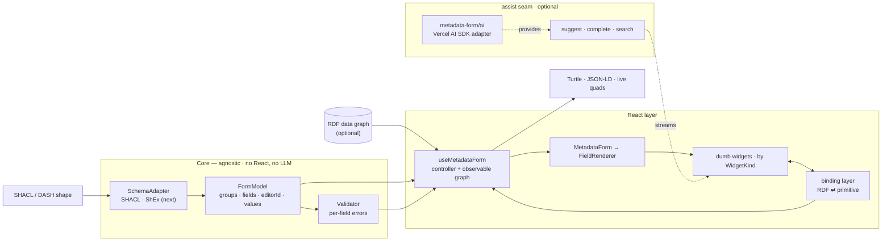

# metadata-form

Auto-generate editable **React** forms from **SHACL/DASH** shapes (and, in the
future, ShEx). Pass a SHACL shape (the "model") and an optional RDF data graph;
get a form that edits the graph and serializes back to **Turtle** and
**JSON-LD**.

- 🧩 **Schema-agnostic core** — a `SchemaAdapter` seam isolates the shape
  language. SHACL ships today; ShEx can be added without touching the UI.
- 🧱 **DASH editors** — `dash:editor` selection with a datatype / nodeKind /
  `sh:in` / `sh:class` / `sh:node` fallback.
- 🎨 **Radix-native + overridable** — renders with
  [@radix-ui/themes](https://www.radix-ui.com/themes); swap any input by
  overriding its widget.
- ✅ **Live SHACL validation** — per-field errors via `rdf-validate-shacl`, plus
  a ready-made `<ValidationSummary>` pill.
- 🤖 **Optional AI assist** — one `assist` seam: streaming inline ghost-text
  completion (a CodeMirror editor; Tab/Esc) and live value suggestions, with a
  one-line [Vercel AI SDK](https://sdk.vercel.ai) adapter. The core imports no LLM SDK.
- 📦 **Bundled example shapes** (e.g. **HealthDCAT-AP**) for demos.

## Install

```sh
npm install metadata-form react react-dom @radix-ui/themes @radix-ui/react-icons
```

ESM-only. The UI is built on [@radix-ui/themes](https://www.radix-ui.com/themes)
(icons from [@radix-ui/react-icons](https://www.radix-ui.com/icons)): render forms
inside a `<Theme>` and import its stylesheet.

## The contract

**SHACL shape + (optional) RDF graph → RDF graph.** Nothing custom.

One way to use it — a controller hook (think `react-hook-form`) plus one
component. The controller owns the editable graph and exposes the live output
reactively, so there is no `onChange`:

```tsx
import { useMetadataForm, MetadataForm, ValidationSummary } from "metadata-form";
import { Theme } from "@radix-ui/themes";
import "@radix-ui/themes/styles.css";

export function App({ shape, graph }: { shape: string; graph?: string }) {
  const form = useMetadataForm({ shapes: shape, data: graph });

  return (
    <Theme>
      <ValidationSummary form={form} />
      <MetadataForm form={form} />
      <button disabled={!form.isValid} onClick={async () => console.log(await form.toTurtle())}>
        Save
      </button>
    </Theme>
  );
}
```

The controller is the single handle for everything:

| | |
|---|---|
| `form.quads` | live data graph (re-derived on each edit) |
| `form.toTurtle()` / `form.toJsonLd()` | serialized output |
| `form.isValid` / `form.errors` | live SHACL validation |
| `form.validate()` / `form.reset()` | imperative actions |
| `form.graph` | the underlying mutable, observable graph |
| `form.report` | derived form state — `{progress, issues, pending, nextField, health}` |
| `form.subscribe(cb)` | observe changes (autosave, external sync) |

### Assistance — one seam (`assist`)

All data/AI help goes through a single `assist` object. The library **never calls
an LLM or a vocabulary service itself** — it maps to the two canonical editor
patterns and renders what these (all optional) callbacks return:

- `suggest` — value candidates for a field, **streamed** into a ✨ popover (a fixed
  window that refills as you dismiss rows); for short free text.
- `complete` — a **streaming** inline continuation (ghost text in a CodeMirror editor;
  **Tab** accepts, **Esc** dismisses); for `textarea`.
- `search` — `sh:class` instance autocomplete (a typeahead combobox); for `reference`.

Every callback gets an `AbortSignal` so the UI can cancel stale runs.

**Simplest setup — the optional `metadata-form/ai` adapter** turns any
[Vercel AI SDK](https://sdk.vercel.ai) model into a ready `assist` (streaming
suggestions + streaming completion), one line:

```tsx
import { createAnthropic } from "@ai-sdk/anthropic";
import { createFormAssist } from "metadata-form/ai"; // optional subpath; peer-deps: ai, zod

const form = useMetadataForm({
  shapes,
  assist: createFormAssist(createAnthropic({ apiKey })("claude-opus-4-8")),
});
```

The core never imports `ai` — the adapter lives at a separate subpath. Add your own
`search` (a real vocabulary service) by spreading: `{ ...createFormAssist(model), search }`.

**Or wire the raw seam yourself** (any stack) — e.g. streaming `complete`:

```tsx
assist={{
  // both stream — each yields items/chunks as they're produced
  suggest: async function* ({ field, locale, signal }) { /* yield FieldSuggestion */ },
  complete: ({ field, value, signal }) => myLLM.stream(value, { signal }), // AsyncIterable<string>
}}
```

The callbacks run in the consumer, so the core imports **no LLM SDK** and stays
portable. The `search` combobox (downshift) and the `suggest` popover (Radix) are accessible.

### The assistant (`<FormAssistant>` + a swappable mascot)

The assistant is split into a **brain** and a **body**. It reads the controller's
`form.report` (validation + completion + a `health` mood/message) with no UI of its
own — so it surfaces the validation report **and** guides. `<FormAssistant>` is a
small, non-intrusive corner companion that renders that state through a mascot and,
on click, gently guides to the next pending field (scroll + focus, never an overlay):

```tsx
<Theme>
  <MetadataForm form={form} />
  <FormAssistant form={form} />
</Theme>
```

The mascot is a **swappable `character`** (same idea as a widget). The default is
a dependency-free emoji; plug a Lottie/Rive character for something custom:

```tsx
<FormAssistant form={form} character={myLottieMascot} />
```

Or build a fully custom surface on top of `form.report` (or `useFormReport(form)`).

### Layout

Arrange the root property groups and lay fields out in columns — all via props
(the shape stays untouched). Groups are keyed by their `sh:PropertyGroup` IRI,
per-field spans by the predicate IRI:

```tsx
<MetadataForm
  form={form}
  layout="tabs"            // "sequential" (default) | "tabs" | "steps"
  grid={{
    columns: 2,            // default columns for every group
    groups: { "http://example.org/group/general": { columns: 1 } },
    spans: { "http://purl.org/dc/terms/description": 2 }, // span 2 columns
  }}
/>
```

Nested sub-forms always render sequentially; only the root honors `layout`.

### Example shapes

Shapes are just SHACL/Turtle strings — bring your own. The **playground** ships a
HealthDCAT-AP demo (`playground/examples/health-dcat-ap/*.ttl`) you can copy; the
library itself ships no shapes (its job is shape→form, not shipping vocabularies).

## Theming

The UI renders with [@radix-ui/themes](https://www.radix-ui.com/themes). Control
the look with Radix's `<Theme>` (appearance, `accentColor`, `radius`, scaling):

```tsx
<Theme appearance="dark" accentColor="indigo" radius="large">
  <MetadataForm form={form} />
</Theme>
```

All RDF ⇄ value conversion lives in one binding layer; the inputs are **dumb
widgets** keyed by `WidgetKind`
(`text | number | date | datetime | url | textarea | boolean | select |
reference | lang`) that receive a primitive `value: string | null` + `onChange`
and never touch RDF. Override any widget per form:

```tsx
import type { WidgetRegistry } from "metadata-form";

const widgets: WidgetRegistry = {
  date: (p) => <MyDatePicker value={p.value} onChange={p.onChange} />,
};

<MetadataForm form={form} widgets={widgets} />;
```

## Architecture



Everything left of the React layer is **agnostic**: the React layer, the
validation display and serialization depend only on `SchemaAdapter` / `FormModel`,
never on SHACL — and nothing in the core imports an LLM SDK (the `assist` seam is
fed entirely by the consumer). Adding **ShEx** means implementing one
`SchemaAdapter` in `src/core/adapters/shex/`; the UI doesn't change. Example shapes
are plain strings, not a special input type — see the playground's
`playground/examples/health-dcat-ap/` (incl. `SOURCE.md`).

## Develop

```sh
npm run dev        # playground at http://localhost:5173
npm test           # vitest
npm run typecheck
npm run build      # ESM + types into dist/
```

## License

MIT
