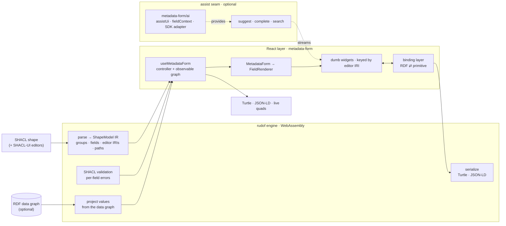

# metadata-form

Auto-generate editable **React** forms from **SHACL** shapes. Pass a SHACL shape
(the "model") and an optional RDF data graph; get a form that edits the graph and
serializes back to **Turtle** and **JSON-LD**.

The shape engine is [**rudof**](https://github.com/rudof-project/rudof) — a Rust
SHACL/ShEx stack — compiled to **WebAssembly**. rudof owns the RDF: it parses the
shapes, validates, projects the form's values out of the data graph, and
serializes the result. metadata-form is the React layer on top: it maps each
field's **SHACL-UI editor** to a widget and renders the form.

- 🦀 **rudof-over-WASM engine** — parsing, **real SHACL validation**, value
  projection, and serialization all run in the rudof wasm module. No JS RDF
  reimplementation; one graph, one source of truth.
- 🎛️ **SHACL-UI editors** — the field's editor comes from the
  [SHACL-UI](https://www.w3.org/TR/shacl12-ui/) `shui:editor` term, with a
  datatype / `nodeKind` / `sh:in` / `sh:class` / `sh:node` fallback.
- 🎨 **Kanzo-native + overridable** — renders with
  [@kanzo-tech/ui](https://github.com/Kanzo-Tech/kanzo-ui) over
  [Ark UI](https://ark-ui.com); swap any input by overriding its widget.
- ✅ **Live validation** — per-field errors from rudof's SHACL validator, plus a
  ready-made `<ValidationSummary>` pill.
- 🤖 **Optional AI assist** — one `assist` seam, and a separate `metadata-form/ai`
  subpath that draws it: streaming ghost text in textareas (Tab/Esc), ✨ value
  suggestions under text fields, prompts built from the field's own SHACL
  constraints, and a one-line [Vercel AI SDK](https://sdk.vercel.ai) adapter.
  The core imports no AI package.
- 📦 **Bundled example shapes** (e.g. **HealthDCAT-AP**) in the playground.
- 🧩 **ShEx-ready** — the engine seam is shape-language-agnostic; ShEx can be
  added without touching the UI.

## Install

```sh
npm install metadata-form react react-dom lucide-react tailwindcss @kanzo-tech/ui
```

The AI layer is opt-in and has its own peers (`@kanzo-tech/ai`, and `ai` + `zod`
for the model adapter) — see [Assistance](#assistance--one-seam-assist).

ESM-only, React 19+, Tailwind CSS v4. The UI is built on **@kanzo-tech/ui**
(icons from [lucide](https://lucide.dev)), which ships Tailwind *source*, not
compiled CSS: your build compiles it, together with this library's classes, in
one stylesheet.

```css
@import "tailwindcss";
@import "@kanzo-tech/ui/tailwind.css";
@import "metadata-form/tailwind.css";
```

(With Vite, add `@tailwindcss/vite`.) Then put the theme attributes
on `<html>` with `KanzoThemeProvider`. There is **no wrapper component to render
inside** — Ark's overlays portal to `document.body`, outside anything a wrapper
could reach, and density sets the root font-size the whole `rem` scale resolves
against.

### The wasm engine

metadata-form depends on **[`@kanzo-tech/rudof-wasm`](https://www.npmjs.com/package/@kanzo-tech/rudof-wasm)**
(installed automatically) — the rudof engine as a `wasm-bindgen` `--target web`
module. The `.wasm` binary loads lazily the first time a form mounts, so importing
the library never pulls it until you use it.

Your **bundler serves the `.wasm`**. With Vite, keep it out of the dependency
pre-bundle so the binary is served verbatim (otherwise the dev server returns HTML
and you get `WebAssembly.instantiate: expected magic word`):

```ts
// vite.config.ts
export default defineConfig({
  optimizeDeps: { exclude: ["@kanzo-tech/rudof-wasm"] },
});
```

Most app bundlers (webpack 5, Next.js, etc.) handle the `new URL(..., import.meta.url)`
wasm asset out of the box. Static hosts serve `.wasm` as `application/wasm` by default.

## The contract

**SHACL shape + (optional) RDF graph → RDF graph.** Nothing custom.

One way to use it — a controller hook (think `react-hook-form`) plus one
component. The controller owns the editable graph and exposes the live output
reactively, so there is no `onChange`:

```tsx
import { useMetadataForm, MetadataForm, ValidationSummary } from "metadata-form";
import { KanzoThemeProvider } from "@kanzo-tech/ui";

export function App({ shape, graph }: { shape: string; graph?: string }) {
  const form = useMetadataForm({ shapes: shape, data: graph });

  return (
    <KanzoThemeProvider>
      <ValidationSummary form={form} />
      <MetadataForm form={form} />
      <button disabled={!form.isValid} onClick={async () => console.log(await form.toTurtle())}>
        Save
      </button>
    </KanzoThemeProvider>
  );
}
```

Shapes and data are **strings** — Turtle or JSON-LD; rudof parses both. The
controller is the single handle for everything:

| | |
|---|---|
| `form.quads` | live data graph (re-derived on each edit) |
| `form.toTurtle()` / `form.toJsonLd()` | serialized output (via rudof) |
| `form.isValid` / `form.errors` | live SHACL validation |
| `form.validate()` / `form.reset()` | imperative actions |
| `form.report` | derived form state — `{progress, issues, pending, nextField, health}` |
| `form.subscribe(cb)` | observe changes (autosave, external sync) |

### Public API

The main entry is deliberately small.

| Export | |
|---|---|
| `useMetadataForm`, `MetadataForm` | the controller hook and the component that renders it |
| `ValidationSummary`, `ValidationPanel` | the issue pill and the issue list |
| `defaultWidgets`, `Editors` | the widget registry and the `shui:` editor IRIs it is keyed by |
| types | the form model (`FormModel`, `FieldModel`, …), the report (`FormReport`, `FieldError`, …), the widget contract (`Widget`, `WidgetProps`, `WidgetRegistry`, …), `FormAssist`, `AssistUi`, `Strings`, `StringTables` |

Everything else is on a subpath: `metadata-form/rudof` (the engine and the shape
IR), `metadata-form/ai` (the AI layer: UI, prompt context, model adapter), `metadata-form/i18n` (languages other than
English, as data), `metadata-form/tailwind.css`.

### Languages

What the reader sees comes from three places, and the library says which:

| What | Where it comes from | Localised how |
|---|---|---|
| field labels (`sh:name`), help (`sh:description`), group names, `sh:or` alternative names, the author's `sh:message` | **the profile** — language-tagged literals in the shapes graph | picked by the reader's languages |
| the wording of a failure when the author wrote no `sh:message` | **the engine's message catalog** — RDF triples `<constraint component> sh:message "…"@lang`, English, Spanish and Catalan built in | picked by the same function |
| placeholders, `Yes`/`No`, counts, progress, the read-only reasons, the findings panel | **the strings table** — typed, English built in | by language tag |

```tsx
import { es, ca } from "metadata-form/i18n"; // languages other than English, as data

useMetadataForm({
  shapes,
  locale: ["ca", "es"],                          // ordered, most preferred first; default: navigator.languages, else "en"
  strings: { es: es.strings, ca: ca.strings },   // interface strings, by tag
  messages: "…",                                 // more default failure messages, as Turtle (see below)
});
```

**Picking.** One function picks every language-tagged string. It follows the SHACL-UI
Editor's Draft, *Label and Language Resolution*: the order of the property shape's
`sh:languageIn`, then the application's list (`locale`), with the browser's
`navigator.languages` as the default; tags match ranges by RFC 4647 §3.3.1 basic
filtering (the tag `en-US` matches the range `en`, and `en` does not match `en-US`, so
give `["es-ES", "es"]`, as a browser does); when nothing matches, an untagged literal,
else any. A property with no `sh:name` is labelled with its local name split into words;
the draft's two intermediate steps (an `rdfs:label` of the predicate in the data or shapes
graph) are **not** taken, since the shape IR does not carry them.

**Messages come from the engine.** A validation result carries its messages
language-tagged, and the form picks the one to draw when it draws it, so changing `locale`
re-words the errors already on screen without validating again. A result whose shape has an
`sh:message` carries exactly the author's literals (SHACL §2.1.5). A result whose shape has
none carries one message per language of the engine's catalog, generated from RDF inside the
engine — `sh:MinCountConstraintComponent sh:message "At least {$minCount} value(s) required"@en .`,
with the constraint's parameters filled in (`shacl/src/messages/README.md` in the engine says
what the standards fix and what the engine chose). Reading `sh:message` off a constraint
component is the engine's convention, not a rule of the SHACL recommendation;
`sh:ConstraintComponent` holds the message for any component the catalog does not name. A
reader whose language has no message gets English.

**Adding a language** is supplying data, with no code change: triples for the messages
(`messages: "@prefix sh: <http://www.w3.org/ns/shacl#> . sh:MinCountConstraintComponent sh:message \"Ce champ est obligatoire\"@fr ."`,
handed to the engine's `Session.loadMessages`; later documents win per component and language,
so the same option re-words a built-in message) and a table for the strings
(`strings: { fr: { chrome: { yes: "Oui", no: "Non" } } }`; a table may be partial and what it
leaves out stays English). The same `strings` option re-words English itself (`{ en: { … } }`).

**Localised by the form's language.** `<MetadataForm>` mounts Kanzo UI's `LocaleProvider`
with the first language of the list, so the calendar, number formatting and collation follow
it; the words of the parts the design system draws (`LanguagePicker`, `FieldArray`, the
steps' Back and Next, the ✨ and its announcement) are in the strings table.

**Not localised.** The accessible names Ark's machines carry by default (the calendar's
"Open calendar", the tags input's delete button) are English: `@kanzo-tech/ui` does not
expose them as props. In the completion's keys hint (`CompleteHint`) the words after
<kbd>Tab</kbd> and <kbd>Esc</kbd> are English for the same reason. The `Diagnostic` messages
passed to `onDiagnostic` (developer-facing) and any text the AI adapter's prompts contain are
English. A shape's `sh:languageIn` orders the labels of its own property; it is not consulted
when choosing a failure message. Plural forms follow `Intl.PluralRules` for the table's
language, so a table must supply the forms its language uses.

### Assistance — one seam (`assist`)

All data/AI help goes through a single `assist` object with three optional
callbacks: `suggest` (value candidates, streamed), `complete` (a streamed inline
continuation at the caret) and `search` (`sh:class` instances for a reference
combobox). Every callback gets an `AbortSignal`. The library **never calls an LLM
or a vocabulary service itself**, and the core **draws no assistance UI**: without
`metadata-form/ai` a form renders plain inputs and plain textareas, and a wired
`assist.suggest`/`assist.complete` is never called (`search` feeds the reference
combobox with or without it).

**Enabling it** takes one import and one prop. `assistUi` is
[`@kanzo-tech/ai`](https://github.com/Kanzo-Tech/kanzo-ui)'s ✨ suggestion strip
(under text and reference fields) and ghost-text completion (over `textarea`,
`rich text` and the language-tagged textarea), handed to the form:

```tsx
import { assistUi, createFormAssist } from "metadata-form/ai"; // peers: @kanzo-tech/ai, ai, zod
import { createAnthropic } from "@ai-sdk/anthropic";

const assist = createFormAssist(createAnthropic({ apiKey })("claude-opus-4-8"));
const form = useMetadataForm({ shapes, assist });
return <MetadataForm form={form} assistUi={assistUi} />;
```

`createFormAssist` turns any [Vercel AI SDK](https://sdk.vercel.ai) `LanguageModel`
into streamed `suggest` and `complete`; add your own `search` (a real vocabulary
service) by spreading: `{ ...createFormAssist(model), search }`. It is the only
part that touches the SDK, and it is domain-free — it only maps the SDK's streams
onto the `AsyncIterable` sources `@kanzo-tech/ai` consumes. With another stack,
implement the seam yourself and keep `assistUi`:

```tsx
assist={{
  suggest: async function* ({ field, focus, graph, locale, signal }) { /* yield { value, label?, rationale? } */ },
  complete: ({ field, value, position, signal }) => myLLM.stream(value, { signal }), // AsyncIterable<string>
}}
```

**What the model is told.** The default prompts are written from `fieldContext(field)`
— everything the field's own shape states, one line per fact and nothing it does
not state: label, description, value type (`sh:datatype` / `sh:nodeKind` /
`sh:class`), `sh:in` options, `sh:pattern` (+ flags), length and numeric bounds,
allowed language tags (`sh:languageIn`), cardinality, and the values a repeatable
field already holds — plus `siblingValues(…)`: the literals already entered on the
same resource (predicate local name and value, up to 12, each cut at 200
characters). For a completion the text before and after the caret is added. The
model is asked to satisfy the constraints; the shape still validates whatever is
committed. Override the prompts with `createFormAssist(model, { suggestPrompt,
completePrompt })` — `fieldContext` and `siblingValues` are exported for that.

### Layout

Arrange the root property groups and lay fields out in columns — all via props
(the shape stays untouched). Groups are keyed by their `sh:PropertyGroup` IRI,
per-field spans by the predicate IRI:

```tsx
<MetadataForm
  form={form}
  layout="tabs"            // "sequential" (default) | "tabs" | "steps"
  grid={{
    columns: 2,            // default columns for every group
    groups: { "http://example.org/group/general": { columns: 1 } },
    spans: { "http://purl.org/dc/terms/description": 2 }, // span 2 columns
  }}
/>
```

Nested sub-forms always render sequentially; only the root honors `layout`.

### Example shapes

Shapes are just SHACL/Turtle strings — bring your own. The **playground** ships a
HealthDCAT-AP demo (`examples/health-dcat-ap/*.ttl`) you can copy; the
library itself ships no shapes (its job is shape→form, not shipping vocabularies).

## SHACL-UI editors (`shui:`)

A field's input is chosen from the [SHACL-UI](https://www.w3.org/TR/shacl12-ui/)
vocabulary. Annotate a property shape with `shui:editor` to pick one explicitly:

```turtle
@prefix sh:   <http://www.w3.org/ns/shacl#> .
@prefix shui: <http://www.w3.org/ns/shacl-ui/> .
@prefix ex:   <http://example.org/> .

ex:DatasetShape a sh:NodeShape ;
  sh:property [ sh:path ex:description ; shui:editor shui:TextAreaEditor ] ;
  sh:property [ sh:path ex:publisher   ; sh:node ex:AgentShape ; shui:editor shui:DetailsEditor ] .
```

When `shui:editor` is absent, rudof resolves an editor from the field's
constraints — `sh:datatype`, `sh:nodeKind`, `sh:in`, `sh:class`, `sh:node`.
metadata-form's job is exactly the editor-IRI → widget binding below, so a new
editor is a widget, not an engine change.

### The mapping

`Repeatable` is the control a field gets when the shape allows more than one value
(no `sh:maxCount 1`). It is selected by **cardinality, not by a second vocabulary**:
`sh:maxCount` already states how many answers a property takes, and inventing
`shui:MultiEnumSelectEditor` would put that fact in a second place that could
disagree with it. Where the column says *rows*, the single-value control repeats
inside a `FieldArray` with add/remove.

| `shui:` editor | Picked when | Control | Repeatable |
| --- | --- | --- | --- |
| `TextFieldEditor` | anything with no better fact (the fallback) | `Input` | **`TagsInput`** — chips, one control |
| `TextAreaEditor` | stated | `Textarea`, ghost-text completion when `assist.complete` and `assistUi` are wired | rows |
| `RichTextEditor` | stated | `Textarea` — **the design system ships no rich-text editor**; the profile asked for something we do not have | rows |
| `TextFieldWithLangEditor` | `sh:datatype rdf:langString` | `InputGroup` + the language picker in its trailing slot | rows |
| `TextAreaWithLangEditor` | stated | `Textarea` (with the same ghost text) + the language picker under it | rows |
| `NumberFieldEditor` | numeric `sh:datatype` | `NumberInput` — steppers, scrubber, `tabular-nums`; bounds from `sh:minInclusive`/`sh:maxInclusive` | rows |
| `BooleanEditor` | `sh:datatype xsd:boolean` | `SegmentGroup` (Yes / No / Not set) — or a `Switch` when `sh:minCount ≥ 1` or `sh:defaultValue` guarantees a value | rows |
| `EnumSelectEditor` | `sh:in` | ≤ 4 options: `SegmentGroup`. ≤ 15: `NativeSelect`. Beyond that a searchable `Combobox` | **`Combobox multiple`** |
| `DatePickerEditor` | `sh:datatype xsd:date` | `DatePicker` + calendar | rows |
| `DateTimePickerEditor` | `sh:datatype xsd:dateTime` | `DatePicker` + a time `Input` | rows |
| `IRIEditor` | `sh:nodeKind sh:IRI`, or `xsd:anyURI` | `Input type="url"` | rows |
| `AutoCompleteEditor` | `sh:class` | `Combobox` over `assist.search`, custom IRIs allowed; plain IRI entry with no `assist` | **`Combobox multiple`** (`TagsInput` with no `assist`) |
| `InstancesSelectEditor` | stated | same body as `AutoCompleteEditor`, its own registry entry | as above |
| `SubClassEditor` | stated | same body as `AutoCompleteEditor`, its own registry entry — **see the gap below** | as above |
| `DetailsEditor` | `sh:node` | a nested `<NodeForm>` inside a `FieldArray` | rows |
| `BlankNodeEditor` | stated | the same nested sub-form: whether the resource gets an IRI is the graph's business, not the form's | rows |

An explicit `shui:editor` always wins, including over the repeatable form — so
overriding one field is one registry entry, never a fork of the selection rules.

### What this does not render

Honest gaps, not oversights. Every one of these is still **validated** — the engine
sees the whole shape; it is the *input* that cannot express the constraint.

- **`sh:minExclusive` / `sh:maxExclusive`** — `NumberInput`'s bounds are inclusive,
  and there is no epsilon that is right for both `xsd:integer` and `xsd:double`.
  Carried on `WidgetProps` for a widget that wants to say so.
- **`sh:pattern` / `sh:flags`** — deliberately **not** the HTML `pattern`
  attribute. `sh:pattern` is an unanchored XPath regex and the attribute is
  implicitly `^(?:…)$`, so `sh:pattern "[0-9]{4}"` would reject `AB1234`, which the
  shape accepts; `sh:flags` has no representation there at all. Carried as
  information; the engine enforces the real regex on commit.
- **`sh:minLength`** — reaches the input's `minLength` attribute, which nothing
  enforces outside a native form submit. The engine is what rejects a short value.
- **`sh:uniqueLang`** — a repeatable `rdf:langString` field renders as rows of
  tagged inputs, and nothing stops two of them carrying `@es`. The violation
  arrives from the validator after the fact.
- **`rdf:langString` + repeatable** — no one-control form: chips would hide the
  text, and a tag per chip has nowhere to live.
- **`sh:hasValue`** — the required value is neither pre-filled nor pinned; it shows
  up as a validation message when it is missing.
- **`sh:qualifiedValueShape`** — no control distinguishes "at least two of these
  values must match *that* shape" from the rest of the list.
- **Class hierarchies (`SubClassEditor`)** — a real gap. rudof projects options as
  a flat `WidgetOption[]`, so nobody — not even a consumer overriding the
  editor — can reach a `TreeView`: the tree is not in the data to render. Three
  reference editors sharing one body is honest until the projection carries
  `subClasses`. Until then, override the entry with your own control if you have a
  hierarchy to show.

## Theming

The look is the design system's, applied as `data-*` attributes on `<html>` by
`KanzoThemeProvider` and controlled by the user through its own `Preferences`
panel (appearance, theme, density, radius, fonts). Drop
`<PreferencesRoot><PreferencesTrigger/><PreferencesPanel/></PreferencesRoot>`
anywhere in your app and the form follows.

All RDF ⇄ value conversion lives in one binding layer; the inputs are **dumb
widgets** that receive a primitive `value: string | null` + `onChange` and never
touch RDF.

A registry is keyed by the property's **SHACL-UI editor IRI** — the one rudof
resolves for every property, explicitly from the shape or inferred from its type
facts. There is no intermediate widget taxonomy: both ends of the mapping are
vocabularies somebody else maintains, and a third invented in between could only
lose information. Keying on the IRI also makes the registry open — a profile with
a custom `shui:editor` is one more entry rather than a new case in core.

Override any widget per form:

```tsx
import { Editors, type WidgetRegistry } from "metadata-form";

const widgets: WidgetRegistry = {
  [Editors.DatePicker]: (p) => <MyDatePicker value={p.value} onChange={p.onChange} />,
  // A class hierarchy asked for a tree, and now it can have one without
  // touching plain autocomplete.
  [Editors.SubClass]: (p) => <MyClassTree value={p.value} onChange={p.onChange} />,
};

<MetadataForm form={form} widgets={widgets} />;
```

## Architecture



rudof (left) owns every RDF concern — parsing, validation, projection,
serialization, and SHACL-UI editor resolution — over a **single** wasm graph. The
React layer is shape-language-agnostic: it consumes the `ShapeModel` IR and binds
editor IRIs to widgets, and nothing in it imports an AI package (the `assist` seam is
fed, and drawn, by `metadata-form/ai` or by the consumer). Adding **ShEx** is an engine-side change behind the
same IR; the UI doesn't move.

### `metadata-form/rudof` — direct engine access

Power-user wiring lives at the `./rudof` subpath: a shared `RudofEngine`, custom
projection, or a raw graph session, without going through the hook. It also
carries the shape IR types (`ShapeModel`, `NodeShapeIR`, `PropertyShapeIR`,
`ProjectedForm`, …).

```ts
import { createRudofEngine, projectTree } from "metadata-form/rudof";

const engine = createRudofEngine();
const model = await engine.loadShapes(shapesTurtle);
await engine.loadData(dataTurtle);
```

## Develop

```sh
npm run dev          # standalone playground (Vite) — http://localhost:5173
npm test             # vitest
npm run typecheck    # library + playground projects
npm run build        # ESM + types into dist/ (library only)
npm run build:playground   # the standalone playground app
```

The playground is its own app under `playground/` with its own Vite/TS config; the
library build (`npm run build`) is decoupled from it.

**Contributors — building the wasm.** `@kanzo-tech/rudof-wasm` is published from the
[rudof fork](https://github.com/Kanzo-Tech/rudof); `rudof_wasm/build.sh` in that fork rebuilds it
(wasm-pack `--target web`) when you need to test an unpublished engine change.

## License

MIT
