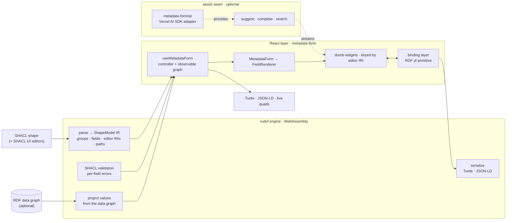

# metadata-form

Auto-generate editable **React** forms from **SHACL** shapes. Pass a SHACL shape
(the "model") and an optional RDF data graph; get a form that edits the graph and
serializes back to **Turtle** and **JSON-LD**.

The shape engine is [**rudof**](https://github.com/rudof-project/rudof) — a Rust
SHACL/ShEx stack — compiled to **WebAssembly**. rudof owns the RDF: it parses the
shapes, validates, projects the form's values out of the data graph, and
serializes the result. metadata-form is the React layer on top: it maps each
field's **SHACL-UI editor** to a widget and renders the form.

- 🦀 **rudof-over-WASM engine** — parsing, **real SHACL validation**, value
  projection, and serialization all run in the rudof wasm module. No JS RDF
  reimplementation; one graph, one source of truth.
- 🎛️ **SHACL-UI editors** — the field's editor comes from the
  [SHACL-UI](https://www.w3.org/TR/shacl12-ui/) `shui:editor` term, with a
  datatype / `nodeKind` / `sh:in` / `sh:class` / `sh:node` fallback.
- 🎨 **Kanzo-native + overridable** — renders with
  [@kanzo-tech/ui](https://github.com/Kanzo-Tech/kanzo-ui) over
  [Ark UI](https://ark-ui.com); swap any input by overriding its widget.
- ✅ **Live validation** — per-field errors from rudof's SHACL validator, plus a
  ready-made `<ValidationSummary>` pill.
- 🤖 **Optional AI assist** — one `assist` seam: streaming inline ghost-text
  completion (a CodeMirror editor; Tab/Esc) and live value suggestions, with a
  one-line [Vercel AI SDK](https://sdk.vercel.ai) adapter. The core imports no LLM SDK.
- 📦 **Bundled example shapes** (e.g. **HealthDCAT-AP**) in the playground.
- 🧩 **ShEx-ready** — the engine seam is shape-language-agnostic; ShEx can be
  added without touching the UI.

## Install

```sh
npm install metadata-form react react-dom @kanzo-tech/ui lucide-react
```

ESM-only, React 19+. The UI is built on **@kanzo-tech/ui** (icons from
[lucide](https://lucide.dev)): import its stylesheet and put the theme attributes
on `<html>` with `KanzoThemeProvider`. There is **no wrapper component to render
inside** — Ark's overlays portal to `document.body`, outside anything a wrapper
could reach, and density sets the root font-size the whole `rem` scale resolves
against.

`@kanzo-tech/ai` is an optional peer, needed only if you wire the `assist` seam.

### The wasm engine

metadata-form depends on **[`@kanzo-tech/rudof-wasm`](https://www.npmjs.com/package/@kanzo-tech/rudof-wasm)**
(installed automatically) — the rudof engine as a `wasm-bindgen` `--target web`
module. The `.wasm` binary loads lazily the first time a form mounts, so importing
the library never pulls it until you use it.

Your **bundler serves the `.wasm`**. With Vite, keep it out of the dependency
pre-bundle so the binary is served verbatim (otherwise the dev server returns HTML
and you get `WebAssembly.instantiate: expected magic word`):

```ts
// vite.config.ts
export default defineConfig({
  optimizeDeps: { exclude: ["@kanzo-tech/rudof-wasm"] },
});
```

Most app bundlers (webpack 5, Next.js, etc.) handle the `new URL(..., import.meta.url)`
wasm asset out of the box. Static hosts serve `.wasm` as `application/wasm` by default.

## The contract

**SHACL shape + (optional) RDF graph → RDF graph.** Nothing custom.

One way to use it — a controller hook (think `react-hook-form`) plus one
component. The controller owns the editable graph and exposes the live output
reactively, so there is no `onChange`:

```tsx
import { useMetadataForm, MetadataForm, ValidationSummary } from "metadata-form";
import { KanzoThemeProvider } from "@kanzo-tech/ui";
import "@kanzo-tech/ui/styles.css";

export function App({ shape, graph }: { shape: string; graph?: string }) {
  const form = useMetadataForm({ shapes: shape, data: graph });

  return (
    <KanzoThemeProvider>
      <ValidationSummary form={form} />
      <MetadataForm form={form} />
      <button disabled={!form.isValid} onClick={async () => console.log(await form.toTurtle())}>
        Save
      </button>
    </KanzoThemeProvider>
  );
}
```

Shapes and data are **strings** — Turtle or JSON-LD; rudof parses both. The
controller is the single handle for everything:

| | |
|---|---|
| `form.quads` | live data graph (re-derived on each edit) |
| `form.toTurtle()` / `form.toJsonLd()` | serialized output (via rudof) |
| `form.isValid` / `form.errors` | live SHACL validation |
| `form.validate()` / `form.reset()` | imperative actions |
| `form.report` | derived form state — `{progress, issues, pending, nextField, health}` |
| `form.subscribe(cb)` | observe changes (autosave, external sync) |

### Assistance — one seam (`assist`)

All data/AI help goes through a single `assist` object. The library **never calls
an LLM or a vocabulary service itself** — it maps to the two canonical editor
patterns and renders what these (all optional) callbacks return:

- `suggest` — value candidates for a field, **streamed** into a ✨ popover (a fixed
  window that refills as you dismiss rows); for short free text.
- `complete` — a **streaming** inline continuation (ghost text in a CodeMirror editor;
  **Tab** accepts, **Esc** dismisses); for `textarea`.
- `search` — `sh:class` instance autocomplete (a typeahead combobox); for `reference`.

Every callback gets an `AbortSignal` so the UI can cancel stale runs.

**Simplest setup — the optional `metadata-form/ai` adapter** turns any
[Vercel AI SDK](https://sdk.vercel.ai) model into a ready `assist` (streaming
suggestions + streaming completion), one line:

```tsx
import { createAnthropic } from "@ai-sdk/anthropic";
import { createFormAssist } from "metadata-form/ai"; // optional subpath; peer-deps: ai, zod

const form = useMetadataForm({
  shapes,
  assist: createFormAssist(createAnthropic({ apiKey })("claude-opus-4-8")),
});
```

The core never imports `ai` — the adapter lives at a separate subpath. Add your own
`search` (a real vocabulary service) by spreading: `{ ...createFormAssist(model), search }`.

**Or wire the raw seam yourself** (any stack) — e.g. streaming `complete`:

```tsx
assist={{
  // both stream — each yields items/chunks as they're produced
  suggest: async function* ({ field, locale, signal }) { /* yield FieldSuggestion */ },
  complete: ({ field, value, signal }) => myLLM.stream(value, { signal }), // AsyncIterable<string>
}}
```

The callbacks run in the consumer, so the core imports **no LLM SDK** and stays
portable. The reference combobox and the ✨ suggestion strip are the design
system's own accessible components.

### The assistant (`<FormAssistant>` + a swappable mascot)

The assistant is split into a **brain** and a **body**. It reads the controller's
`form.report` (validation + completion + a `health` mood/message) with no UI of its
own — so it surfaces the validation report **and** guides. `<FormAssistant>` is a
small, non-intrusive corner companion that renders that state through a mascot and,
on click, gently guides to the next pending field (scroll + focus, never an overlay):

```tsx
<>
  <MetadataForm form={form} />
  <FormAssistant form={form} />
</>
```

The mascot is a **swappable `character`** (same idea as a widget). The default is
a dependency-free emoji; plug a Lottie/Rive character for something custom:

```tsx
<FormAssistant form={form} character={myLottieMascot} />
```

Or build a fully custom surface on top of `form.report` (or `useFormReport(form)`).

### Layout

Arrange the root property groups and lay fields out in columns — all via props
(the shape stays untouched). Groups are keyed by their `sh:PropertyGroup` IRI,
per-field spans by the predicate IRI:

```tsx
<MetadataForm
  form={form}
  layout="tabs"            // "sequential" (default) | "tabs" | "steps"
  grid={{
    columns: 2,            // default columns for every group
    groups: { "http://example.org/group/general": { columns: 1 } },
    spans: { "http://purl.org/dc/terms/description": 2 }, // span 2 columns
  }}
/>
```

Nested sub-forms always render sequentially; only the root honors `layout`.

### Example shapes

Shapes are just SHACL/Turtle strings — bring your own. The **playground** ships a
HealthDCAT-AP demo (`playground/examples/health-dcat-ap/*.ttl`) you can copy; the
library itself ships no shapes (its job is shape→form, not shipping vocabularies).

## SHACL-UI editors (`shui:`)

A field's input is chosen from the [SHACL-UI](https://www.w3.org/TR/shacl12-ui/)
vocabulary. Annotate a property shape with `shui:editor` to pick one explicitly:

```turtle
@prefix sh:   <http://www.w3.org/ns/shacl#> .
@prefix shui: <http://www.w3.org/ns/shacl-ui#> .
@prefix ex:   <http://example.org/> .

ex:DatasetShape a sh:NodeShape ;
  sh:property [ sh:path ex:description ; shui:editor shui:TextAreaEditor ] ;
  sh:property [ sh:path ex:publisher   ; sh:node ex:AgentShape ; shui:editor shui:DetailsEditor ] .
```

When `shui:editor` is absent, rudof resolves an editor from the field's
constraints — `sh:datatype`, `sh:nodeKind`, `sh:in`, `sh:class`, `sh:node`. The
known editor IRIs (`shui:TextFieldEditor`, `TextAreaEditor`, `NumberFieldEditor`,
`DatePickerEditor`, `BooleanEditor`, `EnumSelectEditor`, `DetailsEditor`, …) each
map to a React widget; metadata-form's job is exactly this editor-IRI → widget
binding, so a new editor is a widget, not an engine change.

## Theming

The look is the design system's, applied as `data-*` attributes on `<html>` by
`KanzoThemeProvider` and controlled by the user through its own `Preferences`
panel (appearance, theme, density, radius, fonts). Drop
`<PreferencesRoot><PreferencesTrigger/><PreferencesPanel/></PreferencesRoot>`
anywhere in your app and the form follows.

All RDF ⇄ value conversion lives in one binding layer; the inputs are **dumb
widgets** that receive a primitive `value: string | null` + `onChange` and never
touch RDF.

A registry is keyed by the property's **SHACL-UI editor IRI** — the one rudof
resolves for every property, explicitly from the shape or inferred from its type
facts. There is no intermediate widget taxonomy: both ends of the mapping are
vocabularies somebody else maintains, and a third invented in between could only
lose information. Keying on the IRI also makes the registry open — a profile with
a custom `shui:editor` is one more entry rather than a new case in core.

Override any widget per form:

```tsx
import { Editors, type WidgetRegistry } from "metadata-form";

const widgets: WidgetRegistry = {
  [Editors.DatePicker]: (p) => <MyDatePicker value={p.value} onChange={p.onChange} />,
  // A class hierarchy asked for a tree, and now it can have one without
  // touching plain autocomplete.
  [Editors.SubClass]: (p) => <MyClassTree value={p.value} onChange={p.onChange} />,
};

<MetadataForm form={form} widgets={widgets} />;
```

## Architecture



rudof (left) owns every RDF concern — parsing, validation, projection,
serialization, and SHACL-UI editor resolution — over a **single** wasm graph. The
React layer is shape-language-agnostic: it consumes the `ShapeModel` IR and binds
editor IRIs to widgets, and nothing in it imports an LLM SDK (the `assist` seam is
fed entirely by the consumer). Adding **ShEx** is an engine-side change behind the
same IR; the UI doesn't move.

### `metadata-form/rudof` — direct engine access

Power-user wiring lives at the `./rudof` subpath: a shared `RudofEngine`, custom
projection, or a raw graph session, without going through the hook.

```ts
import { createRudofEngine, projectTree } from "metadata-form/rudof";

const engine = createRudofEngine();
const model = await engine.loadShapes(shapesTurtle);
await engine.loadData(dataTurtle);
```

## Develop

```sh
npm run dev          # standalone playground (Vite) — http://localhost:5173
npm test             # vitest
npm run typecheck    # library + playground projects
npm run build        # ESM + types into dist/ (library only)
npm run build:playground   # the standalone playground app
```

The playground is its own app under `playground/` with its own Vite/TS config; the
library build (`npm run build`) is decoupled from it.

**Contributors — building the wasm.** `@kanzo-tech/rudof-wasm` is published from the
[rudof fork](https://github.com/Kanzo-Tech/rudof); `npm run build:wasm` rebuilds it
locally from a sibling `../rudof-fork` checkout (wasm-pack `--target web`) when you
need to test an unpublished engine change.

## License

MIT
